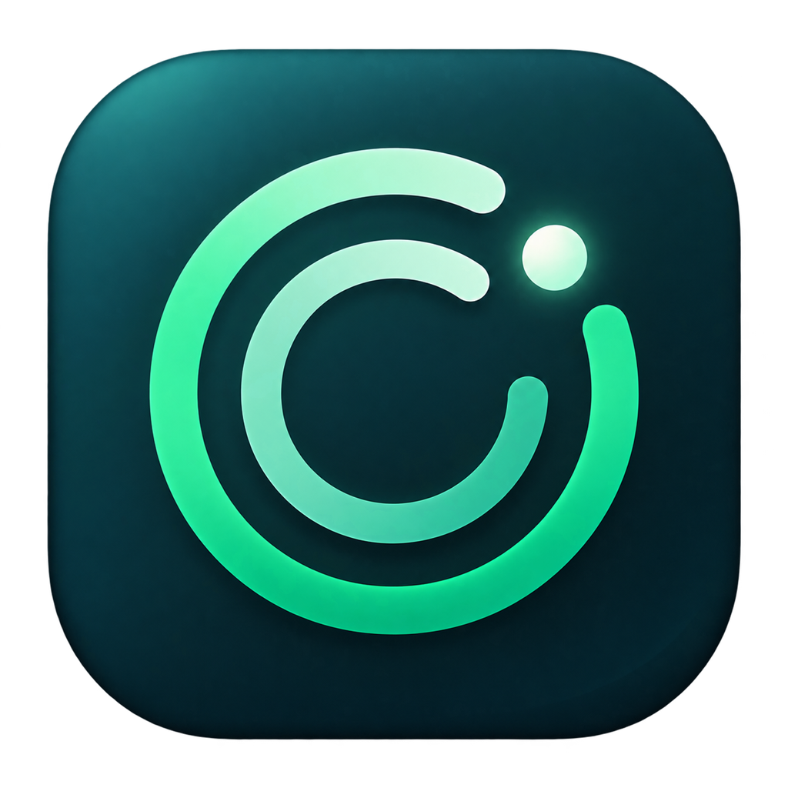

# LiQuota

<p align="center">
  
</p>

LiQuota 是一个面向 Windows 10/11 的轻量 Codex Desktop 额度徽标。它吸附在 Codex 标题栏的空白区域，常驻显示当前最紧张额度窗口的剩余百分比；点击后可以查看账号、套餐、所有额度窗口、进度和重置时间。

LiQuota is a lightweight quota companion for Codex Desktop on Windows 10/11. It docks into the free title-bar area and keeps the most constrained quota visible without modifying Codex itself.

**下载最新版：[GitHub Releases](https://github.com/Oldleeo/LiQuota/releases/latest)**

## 功能

- 自动读取 Codex Desktop 当前登录账号，界面默认对邮箱做隐私遮罩
- 自动识别 5 小时、7 天及未来可能新增的其他额度窗口，不写死套餐规则
- 同时支持 `rateLimitsByLimitId` 与旧版 `rateLimits` 响应
- 额度或账号变化时自动更新，并保留每分钟轮询作为容错
- 跟随 Codex 窗口移动、缩放、最小化和多显示器 DPI
- 弹层右侧与徽标右侧对齐，支持位置像素级微调
- 跟随 Windows 浅色/深色主题，也可手动指定
- 可复制脱敏额度摘要，可选 20% 低额度提醒
- 支持开机启动、托盘回退、单实例运行和单文件免安装发布

## 系统要求

- Windows 10 1809 或更高版本，或 Windows 11
- x64 或 ARM64
- 已安装并登录 Codex Desktop

LiQuota 不需要 API Key，不修改 Codex 安装目录，也不保存账号、登录令牌或额度响应。它只在本机保存主题、吸附偏移和提醒开关。

## 使用

1. 从 Releases 下载与你电脑架构匹配的压缩包。
2. 解压后运行 `LiQuota.exe`。
3. 左键点击徽标展开详情；右键可刷新、复制摘要、调整位置、切换主题或退出。

如果 Codex 未运行，LiQuota 会留在系统托盘等待；打开 Codex 后会自动吸附。

## 从源码构建

需要 [.NET 8 SDK](https://dotnet.microsoft.com/download/dotnet/8.0)。

```powershell
dotnet restore .\LiQuota.csproj
dotnet run --project .\tests\LiQuota.SmokeTests\LiQuota.SmokeTests.csproj -c Release
dotnet publish .\LiQuota.csproj -c Release -r win-x64 --self-contained true -p:PublishSingleFile=true
```

也可以运行：

```powershell
.\scripts\build-release.ps1
```

产物会写入 `artifacts\`，并生成 SHA-256 校验文件。

离线环境可显式传入本机 NuGet 配置：

```powershell
.\scripts\build-release.ps1 -Runtime win-x64 -NuGetConfig C:\path\to\NuGet.offline.Config
```

## 数据来源与安全边界

LiQuota 使用本机 Codex 可执行文件启动官方 App Server，通过 `account/read` 和 `account/rateLimits/read` 获取当前身份和额度。它是独立伴随窗口，不注入 Codex 进程、不修改 `app.asar`、不绕过任何访问控制。

详见 [PRIVACY.md](docs/PRIVACY.md) 和 [SECURITY.md](SECURITY.md)。

## 参与贡献

欢迎提交 Issue 和 Pull Request。开始前请阅读 [CONTRIBUTING.md](CONTRIBUTING.md)。

## 免责声明

LiQuota 是社区项目，与 OpenAI 无隶属或官方背书关系。Codex App Server 协议可能随 Codex 更新而变化。

## License

[MIT](LICENSE)
