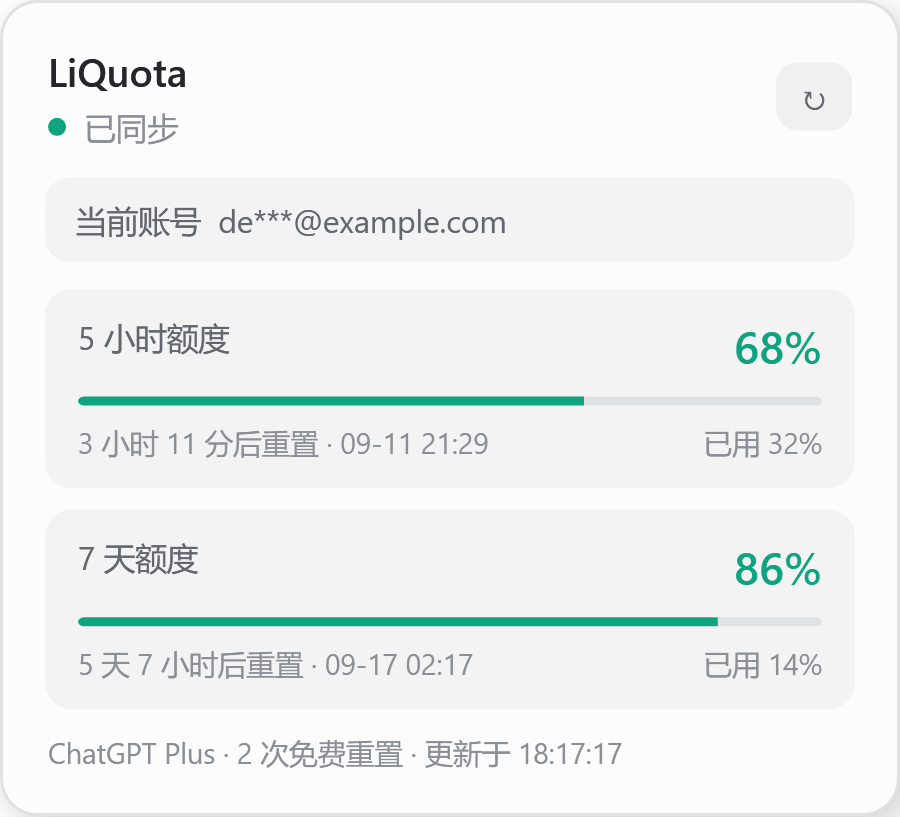
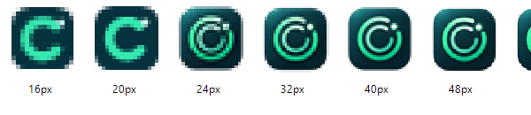
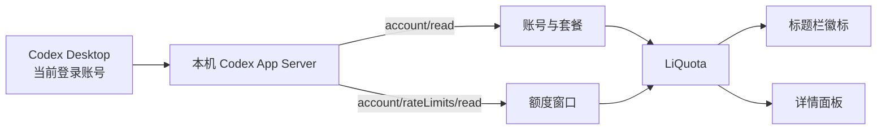

<div align="center">
  

  <h1>LiQuota</h1>
  <p><strong>把 Codex 剩余额度，放在你真正会看的地方。</strong></p>
  <p>一款为 Windows 10/11 打造的轻量 Codex Desktop 额度伴侣。<br>无需打开设置页，标题栏上随时可见；点一下，所有额度窗口一目了然。</p>

  <p>
    <a href="https://github.com/Oldleeo/LiQuota/releases/latest"></a>
    <a href="https://github.com/Oldleeo/LiQuota/actions/workflows/build.yml"></a>
    <a href="LICENSE"></a>
    
    
  </p>

  <p>
    <a href="https://github.com/Oldleeo/LiQuota/releases/latest/download/LiQuota-win-x64.zip"><strong>下载 x64</strong></a>
    ·
    <a href="https://github.com/Oldleeo/LiQuota/releases/latest/download/LiQuota-win-arm64.zip"><strong>下载 ARM64</strong></a>
    ·
    <a href="https://github.com/Oldleeo/LiQuota/releases/latest">查看 Release</a>
  </p>

  <sub>LiQuota is a compact, privacy-minded quota companion for Codex Desktop on Windows.</sub>
</div>

## 为什么做 LiQuota？

Codex 的额度很重要，但默认需要进入使用情况页面才能确认。LiQuota 把最紧张额度窗口的**剩余百分比**固定在 Codex 标题栏空白处：它不抢任务栏、不占桌面，也不会挡住你的工作内容。

点击这个小徽标，会展开一个与 Codex 视觉风格相融的详情面板。5 小时、7 天，或以后出现的其他额度窗口，都由当前账号的真实响应动态识别，而不是写死在程序里。

## 一眼看懂

<table>
  <tr>
    <td width="62%" align="center">
      
      <br><sub>所有额度窗口、重置倒计时与脱敏账号</sub>
    </td>
    <td width="38%" align="center">
      
      <br><sub>标题栏常驻徽标</sub>
      <br><br>
      
      <br><sub>为 Windows 小尺寸显示优化的图标</sub>
    </td>
  </tr>
</table>

> 截图使用内置演示数据生成，不包含真实账号或使用记录。

## 核心能力

| | 能力 | 说明 |
|---|---|---|
| 👁️ | **抬眼即见** | 自动吸附到 Codex 标题栏，显示当前最紧张额度窗口的剩余比例 |
| 🧭 | **动态识别** | 自动读取当前账号、套餐、5 小时/7 天及未来新增的额度窗口 |
| ⚡ | **及时更新** | 额度或账号变化时主动刷新，并以每分钟轮询作为容错 |
| 🖥️ | **贴合 Windows** | 支持 Windows 10/11、x64/ARM64、多显示器、DPI 与浅色/深色主题 |
| 🔔 | **低额度提醒** | 可选 20% 系统通知；也可复制一份隐私脱敏的额度摘要 |
| 🧩 | **轻量独立** | 单文件免安装、托盘回退、单实例运行，不修改 Codex 安装文件 |

## 下载与使用

| Windows 设备 | 下载 |
|---|---|
| 常见 Intel / AMD 电脑 | [LiQuota-win-x64.zip](https://github.com/Oldleeo/LiQuota/releases/latest/download/LiQuota-win-x64.zip) |
| Windows on ARM 设备 | [LiQuota-win-arm64.zip](https://github.com/Oldleeo/LiQuota/releases/latest/download/LiQuota-win-arm64.zip) |

1. 下载与你电脑架构匹配的压缩包并解压。
2. 打开 Codex Desktop，并确保账号已经登录。
3. 运行 `LiQuota.exe`；徽标会自动出现在 Codex 标题栏。

左键点击徽标查看详情；右键可刷新、复制摘要、微调位置、切换主题、设置开机启动或退出。如果 Codex 尚未运行，LiQuota 会留在系统托盘等待，检测到 Codex 后自动吸附。

> 首次运行时若 Windows SmartScreen 提示“未知发布者”，这是因为开源发行包暂未购买商业代码签名证书。你可以先核对 Release 中的 SHA-256 校验值，再选择“更多信息 → 仍要运行”。

## 它如何工作



LiQuota 是一个独立的 WPF 伴随窗口。它通过本机 Codex 可执行文件启动官方 App Server，并读取 `account/read` 与 `account/rateLimits/read`；不会向 Codex 进程注入代码，也不会修改 `app.asar`。

## 隐私设计

- 不要求 API Key，不保存登录令牌、账号资料或额度响应
- 邮箱只在界面中以脱敏形式显示
- 与 Codex 的数据交互发生在本机，不自建云端服务
- 本地只保存主题、吸附偏移、提醒和开机启动等设置
- 公开演示截图由 `--qa-demo` 的固定假数据生成

详细边界见 [隐私说明](docs/PRIVACY.md) 与 [安全策略](SECURITY.md)。

## 常见问题

<details>
  <summary><strong>支持有 5 小时限额的账号吗？</strong></summary>
  <br>
  支持。LiQuota 不根据套餐名称猜测额度，而是读取当前账号实际返回的窗口；5 小时、7 天和其他窗口都会自动展示。
</details>

<details>
  <summary><strong>切换 Codex 账号后需要重启吗？</strong></summary>
  <br>
  通常不需要。LiQuota 会监听账号与额度变化并重新读取，另外保留定时刷新作为容错。
</details>

<details>
  <summary><strong>这是 Codex 插件吗？会修改官方客户端吗？</strong></summary>
  <br>
  不是注入式插件。它是一个与 Codex 窗口绑定位置的独立 Windows 应用，不修改官方客户端文件，因此 Codex 更新后更容易维护和恢复。
</details>

<details>
  <summary><strong>为什么更新后仍看到旧图标？</strong></summary>
  <br>
  Windows 可能缓存旧版 EXE 图标。请使用最新版压缩包中新的 `LiQuota.exe`；必要时删除旧快捷方式并重新创建，或把新版程序放到新的文件名/目录后再打开。
</details>

## 从源码构建

需要 [.NET 8 SDK](https://dotnet.microsoft.com/download/dotnet/8.0)。

```powershell
dotnet restore .\LiQuota.csproj
dotnet run --project .\tests\LiQuota.SmokeTests\LiQuota.SmokeTests.csproj -c Release
.\scripts\build-release.ps1
```

发布产物会写入 `artifacts\`，同时生成 `SHA256SUMS.txt`。离线构建可通过 `-NuGetConfig` 指定本机 NuGet 配置。

## 参与贡献

Bug、Windows 兼容性反馈、界面建议和 Pull Request 都欢迎。开始前请阅读 [贡献指南](CONTRIBUTING.md)，版本变化记录见 [CHANGELOG](CHANGELOG.md)。

LiQuota 是社区开源项目，与 OpenAI 无隶属或官方背书关系。Codex App Server 协议可能随官方客户端更新而变化。

## License

[MIT](LICENSE) © LiQuota contributors
